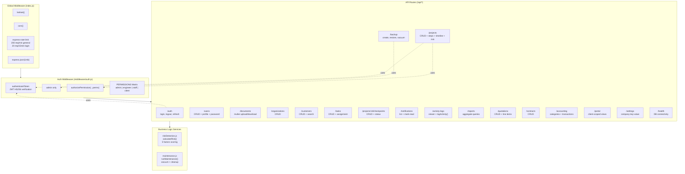
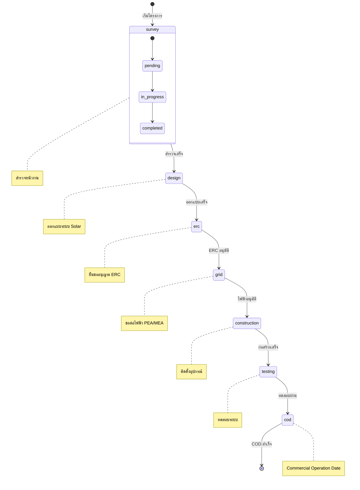
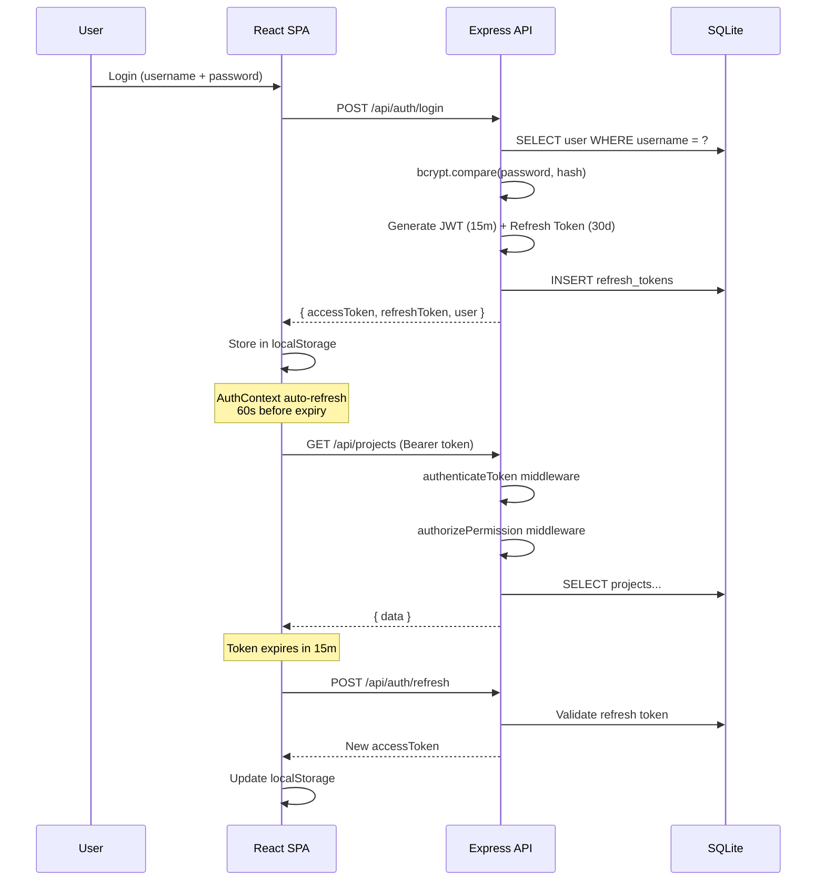
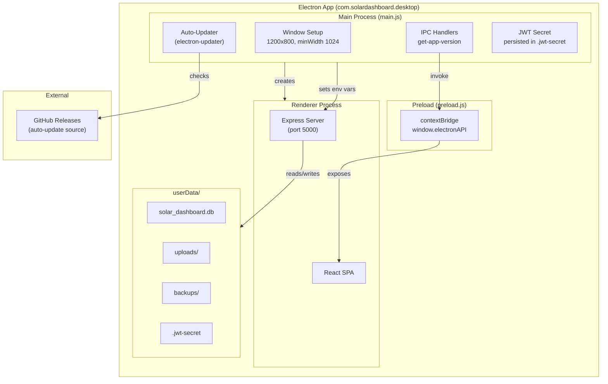
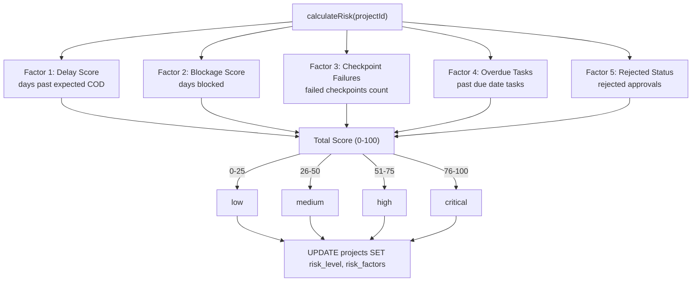
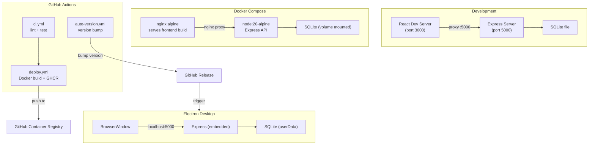

# Solar Dashboard - Architecture Diagrams

## 1. System Architecture (ภาพรวม)

```mermaid
graph TB
    subgraph Client["Client Layer"]
        Desktop["Electron Desktop App<br/>(electron/main.js)"]
        Browser["Web Browser"]
    end

    subgraph Electron["Electron Process"]
        Main["main.js<br/>BrowserWindow"]
        Preload["preload.js<br/>contextBridge → electronAPI"]
        Updater["auto-updater<br/>(electron-updater)"]
        SqliteCompat["sqlite3-compat.cjs<br/>(sql.js WASM shim)"]
    end

    subgraph Frontend["React SPA (frontend/src/)"]
        App["App.jsx<br/>ErrorBoundary → Router → AuthProvider → Toast"]
        Pages["17 Pages (lazy-loaded)"]
        Components["Shared Components"]
        Context["AuthContext.jsx<br/>JWT auto-refresh"]
        Hooks["Custom Hooks<br/>useProjectDetail, useAccounting, useSettings"]
    end

    subgraph Backend["Express Server (backend/src/)"]
        Index["index.js<br/>Port 5000"]
        Middleware["Middleware Layer<br/>helmet, cors, rate-limit, auth"]
        Routes["17 Route Modules"]
        Services["Services<br/>riskDetection, maintenance"]
    end

    subgraph Database["SQLite Database"]
        DB["solar_dashboard.db<br/>22 Tables, WAL mode"]
    end

    subgraph Storage["File Storage"]
        Uploads["uploads/<br/>Documents"]
        Backups["backups/<br/>DB Backups"]
    end

    Desktop -->|loads| Main
    Main -->|BrowserWindow| Index
    Browser -->|HTTP| Index
    Main -.->|IPC: get-app-version, update-status| Preload
    Preload -.->|window.electronAPI| Frontend
    Updater -->|GitHub Releases| Main

    App --> Pages
    App --> Components
    Pages --> Context
    Pages --> Hooks
    Pages -->|Axios /api/*| Index

    Index --> Middleware
    Middleware --> Routes
    Routes --> Services
    Routes --> DB
    Services --> DB
    Routes --> Uploads
    Index --> Backups

    SqliteCompat -.->|require('sqlite3') intercept| DB
```

## 2. Frontend Pages & Routing

```mermaid
graph LR
    subgraph Providers["Provider Hierarchy"]
        EB["ErrorBoundary"] --> Router["BrowserRouter"]
        Router --> Auth["AuthProvider"]
        Auth --> Toast["ToastProvider"]
    end

    subgraph Layout["Layout (AppContent)"]
        Sidebar["Sidebar.jsx"]
        Header["Header.jsx"]
        Main["<main> with Suspense"]
    end

    subgraph AuthRoutes["Not Authenticated"]
        Login["/login → Login.jsx"]
    end

    subgraph AppRoutes["Authenticated Routes"]
        direction TB
        Dashboard["/ → Dashboard.jsx<br/>(client → /portal)"]
        Projects["/projects → Projects.jsx"]
        ProjectDetail["/projects/:id → ProjectDetail.jsx"]
        ProjectReport["/projects/:id/report → ProjectReport.jsx"]
        Customers["/customers → Customers.jsx"]
        Orgs["/organizations → Organizations.jsx"]
        Reports["/reports → Reports.jsx"]
        Users["/users → Users.jsx"]
        Docs["/documents → Documents.jsx"]
        Tasks["/tasks → Tasks.jsx"]
        Settings["/settings → Settings.jsx"]
        Steps["/steps → Steps.jsx"]
        Map["/network-map → NetworkMap.jsx"]
        Contracts["/contracts → Contracts.jsx"]
        Quotations["/quotations → Quotations.jsx"]
        Portal["/portal → CustomerPortal.jsx"]
        Accounting["/accounting → Accounting.jsx"]
    end

    subgraph SharedComponents["Shared Components"]
        direction TB
        Sidebar
        Header
        Toast2["Toast.jsx"]
        RiskBadge["RiskBadge.jsx"]
        KPICards["KPICards.jsx"]
        Pipeline["Pipeline.jsx"]
        StatusModal["StatusModal.jsx"]
        ProjectsTable["ProjectsTable.jsx"]
        ProjectModal["ProjectModal.jsx"]
    end

    Toast --> AppRoutes
    Main --> AppRoutes
```



## 3. Backend API Routes & Middleware



## 4. Database Schema (ER Diagram)

```mermaid
erDiagram
    users {
        TEXT id PK
        TEXT username UK
        TEXT email UK
        TEXT password
        TEXT full_name
        TEXT phone
        TEXT role "admin|engineer|staff|client"
        TEXT permissions
        TEXT status
        DATETIME created_at
        DATETIME updated_at
    }

    customers {
        TEXT id PK
        TEXT customer_name
        TEXT customer_type "individual|company|government"
        TEXT contact_name
        TEXT contact_phone
        TEXT contact_email
        TEXT address
        TEXT tax_id
        TEXT user_id FK
        TEXT status
        DATETIME created_at
    }

    projects {
        TEXT id PK
        TEXT project_name
        TEXT project_code UK
        REAL size_kw
        REAL size_kva
        TEXT province
        TEXT status "not_started|in_progress|completed|cancelled|blocked"
        TEXT current_step "survey|design|erc|grid|construction|testing|cod"
        TEXT scope_start
        TEXT scope_end
        TEXT responsible_user FK
        TEXT customer_id FK
        REAL site_lat
        REAL site_lng
        TEXT risk_level "low|medium|high|critical"
        TEXT risk_factors
        DATE start_date
        DATE expected_cod_date
        DATE actual_cod_date
        REAL budget
        REAL contract_value
    }

    project_steps {
        TEXT id PK
        TEXT project_id FK
        INTEGER step_order
        TEXT step_name
        TEXT status "pending|in_progress|completed|skipped"
        DATE start_date
        DATE end_date
        TEXT responsible_org FK
        TEXT notes
    }

    organizations {
        TEXT id PK
        TEXT org_name UK
        TEXT org_type "erc|pea|mea|tambon|municipal|factory|industrial"
        TEXT status
    }

    project_organizations {
        TEXT id PK
        TEXT project_id FK
        TEXT org_id FK
        TEXT role
        TEXT approval_status "pending|approved|rejected"
        DATETIME approved_at
        TEXT approved_by FK
        TEXT rejection_reason
    }

    documents {
        TEXT id PK
        TEXT project_id FK
        TEXT document_name
        TEXT document_type
        TEXT file_path
        INTEGER file_size
        TEXT upload_by FK
        TEXT validation_status
    }

    project_timeline {
        TEXT id PK
        TEXT project_id FK
        TEXT step
        TEXT status
        TEXT note
        TEXT changed_by FK
        DATETIME created_at
    }

    tasks {
        TEXT id PK
        TEXT project_id FK
        TEXT title
        TEXT description
        TEXT assigned_to FK
        TEXT status "pending|in_progress|completed"
        TEXT priority "low|medium|high"
        DATE due_date
    }

    checkpoints {
        TEXT id PK
        TEXT project_id FK
        TEXT step_name
        TEXT checkpoint_name
        TEXT status "pending|passed|failed"
        TEXT inspected_by FK
        DATETIME inspected_at
        TEXT notes
    }

    checkpoint_logs {
        TEXT id PK
        TEXT checkpoint_id FK
        TEXT old_status
        TEXT new_status
        TEXT changed_by FK
        DATETIME changed_at
    }

    timeline_comments {
        TEXT id PK
        TEXT timeline_id FK
        TEXT comment
        TEXT user_id FK
        DATETIME created_at
    }

    activity_logs {
        TEXT id PK
        TEXT user_id FK
        TEXT action
        TEXT entity_type
        TEXT entity_id
        TEXT details
        DATETIME created_at
    }

    notifications {
        TEXT id PK
        TEXT user_id FK
        TEXT title
        TEXT message
        TEXT type
        TEXT reference_id
        INTEGER is_read
        DATETIME created_at
    }

    refresh_tokens {
        TEXT id PK
        TEXT user_id FK
        TEXT token
        DATETIME expires_at
        DATETIME created_at
    }

    project_specs {
        TEXT id PK
        TEXT project_id FK
        TEXT panel_brand
        TEXT panel_model
        REAL panel_watt
        INTEGER panel_count
        TEXT inverter_brand
        TEXT inverter_model
        REAL inverter_capacity
        TEXT mounting_type
    }

    company_settings {
        TEXT key PK
        TEXT value
        DATETIME updated_at
    }

    quotations {
        TEXT id PK
        TEXT project_id FK
        TEXT customer_id FK
        TEXT quotation_no UK
        TEXT status "draft|sent|accepted|rejected|expired"
        REAL subtotal
        REAL tax_amount
        REAL total
        DATE valid_until
        TEXT notes
        TEXT created_by FK
    }

    quotation_items {
        TEXT id PK
        TEXT quotation_id FK
        TEXT description
        REAL quantity
        TEXT unit
        REAL unit_price
        REAL amount
        INTEGER sort_order
    }

    contracts {
        TEXT id PK
        TEXT project_id FK
        TEXT customer_id FK
        TEXT contract_number UK
        TEXT status "draft|active|completed|terminated"
        REAL contract_value
        DATE start_date
        DATE end_date
        TEXT terms
        TEXT created_by FK
    }

    accounting_categories {
        TEXT id PK
        TEXT name
        TEXT type "income|expense"
        TEXT description
    }

    transactions {
        TEXT id PK
        TEXT project_id FK
        TEXT category_id FK
        TEXT type "income|expense"
        REAL amount
        TEXT description
        DATE transaction_date
        TEXT reference_no
        TEXT created_by FK
    }

    payment_installments {
        TEXT id PK
        TEXT contract_id FK
        TEXT project_id FK
        INTEGER installment_no
        REAL amount
        TEXT description
        DATE due_date
        TEXT status "pending|paid|overdue"
        DATE paid_at
    }

    reports {
        TEXT id PK
        TEXT project_id FK
        TEXT report_type
        TEXT report_name
        TEXT created_by FK
    }

    users ||--o{ projects : "responsible_user"
    users ||--o{ customers : "user_id"
    users ||--o{ documents : "upload_by"
    users ||--o{ tasks : "assigned_to"
    users ||--o{ project_timeline : "changed_by"
    users ||--o{ activity_logs : "user_id"
    users ||--o{ notifications : "user_id"
    users ||--o{ refresh_tokens : "user_id"
    users ||--o{ quotations : "created_by"
    users ||--o{ contracts : "created_by"
    users ||--o{ transactions : "created_by"
    users ||--o{ reports : "created_by"

    customers ||--o{ projects : "customer_id"
    customers ||--o{ quotations : "customer_id"
    customers ||--o{ contracts : "customer_id"

    projects ||--o{ project_steps : "project_id"
    projects ||--o{ documents : "project_id"
    projects ||--o{ project_organizations : "project_id"
    projects ||--o{ project_timeline : "project_id"
    projects ||--o{ tasks : "project_id"
    projects ||--o{ checkpoints : "project_id"
    projects ||--o{ reports : "project_id"
    projects ||--o| project_specs : "project_id"
    projects ||--o{ quotations : "project_id"
    projects ||--o{ contracts : "project_id"
    projects ||--o{ transactions : "project_id"
    projects ||--o{ payment_installments : "project_id"

    organizations ||--o{ project_organizations : "org_id"
    organizations ||--o{ project_steps : "responsible_org"

    project_timeline ||--o{ timeline_comments : "timeline_id"
    checkpoints ||--o{ checkpoint_logs : "checkpoint_id"
    quotations ||--o{ quotation_items : "quotation_id"
    contracts ||--o{ payment_installments : "contract_id"
    accounting_categories ||--o{ transactions : "category_id"
```



## 5. Project Workflow Pipeline



## 6. Authentication & Authorization Flow



## 7. Electron Architecture



## 8. Risk Detection Algorithm



## 9. Deployment Architecture


